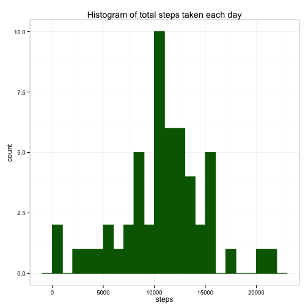
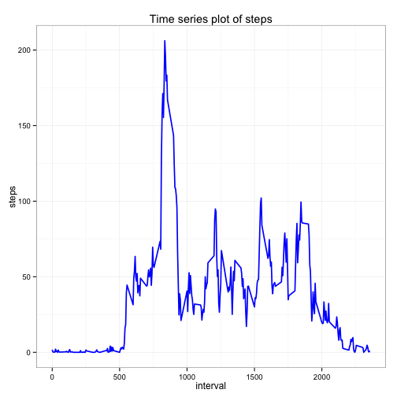
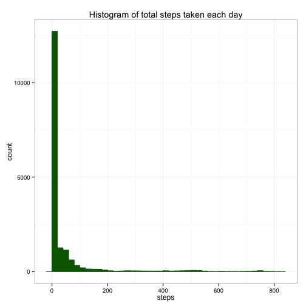
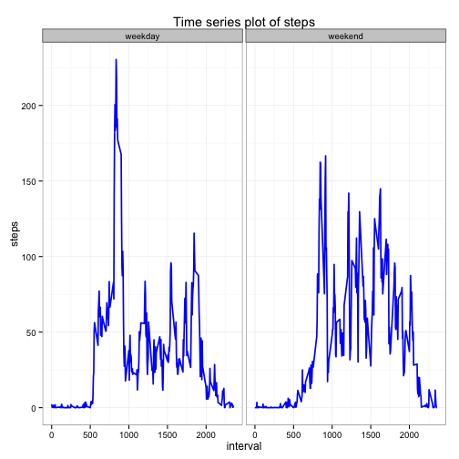

# Reproducible Research: Peer Assessment 1


In this project, we analyse two months of personal movement data from activity monitoring devices of an anonymous person to find patterns, if any, in their behavior. 


## Loading and preprocessing the data

At first, we search for the zip file containing the data in the current directory. The forked directory includes the zip file and we write a code to load the data. However, if such a file doesn't exist, we download the data from the provided url and save the file in the current directory for loading. We write a function to handle the above two cases to provide a generalized code. We used "echo = TRUE" to be able to read the code. 

The code that is needed to

####    1.Load the data

####    2. Process/transform the data into a format suitable for analysis

is given below;


```r
loadData <- function() {
    zipfile <- "activity.zip"
    temp <- unz(zipfile, "activity.csv")  #unzipping the zipfile, making a connection
    Data <- read.csv(temp, header = TRUE)  #reading the csv file
    Data$date <- as.Date(as.character(Data$date), format = "%Y-%m-%d")
    Data$steps <- as.numeric(Data$steps)
    Data$interval <- factor(as.numeric(Data$interval))
    Data
    
}
myData <- loadData()
summary(myData)
```

```
##      steps            date               interval    
##  Min.   :  0.0   Min.   :2012-10-01   0      :   61  
##  1st Qu.:  0.0   1st Qu.:2012-10-16   5      :   61  
##  Median :  0.0   Median :2012-10-31   10     :   61  
##  Mean   : 37.4   Mean   :2012-10-31   15     :   61  
##  3rd Qu.: 12.0   3rd Qu.:2012-11-15   20     :   61  
##  Max.   :806.0   Max.   :2012-11-30   25     :   61  
##  NA's   :2304                         (Other):17202
```

```r
str(myData)
```

```
## 'data.frame':	17568 obs. of  3 variables:
##  $ steps   : num  NA NA NA NA NA NA NA NA NA NA ...
##  $ date    : Date, format: "2012-10-01" "2012-10-01" ...
##  $ interval: Factor w/ 288 levels "0","5","10","15",..: 1 2 3 4 5 6 7 8 9 10 ...
```

Notes:  The date values in `Data$dates` were initially of class factor---a set of numeric codes having character valued levels---and therefore we had to first convert this to the real dates. At the end of the processing, the dates in `Data$dates` are in the ISO 8601 international standard format `%Y-%m-%d`. Furthermore, we converted the `Data$steps` to class numeric from class integer for easy processing as integers account only for whole numbers, whereas class numeric handles both decimals and whole numbers. We converted the `Data$interval` to factors for easy processing. The requirement for converting to a factor is that the variables must be a vector of values which can be either string or numeric. Due to this, we first converted the `Data$interval` to numeric and then to factor. 


## What is mean total number of steps taken per day?


For this, we need to create a histogram of total steps for each day and then calculate the mean and median of these total steps/day.
We need the `aggregate` function which reduces multiple values to a single one. Using `aggregate`, we first calcualte the total number of steps taken per each day. Note, here we ignore the missing values in the dataset. We will be using `ggplot2` plotting package due to its flexibilty.  


####   1. Make a histogram of the total number of steps taken each day


```r
library(ggplot2)  #importing ggplot for plotting

totalStepsPerDay <- function(myData) {
    newData <- aggregate(steps ~ date, myData, FUN = sum, na.rm = TRUE)
    newData
    
}

plotting <- function(theData) {
    m <- ggplot(theData, aes(x = steps))
    m + geom_histogram(colour = "darkgreen", fill = "darkgreen", binwidth = 1000) + 
        ggtitle("Histogram of total steps taken each day") + theme_bw()
    
    
}

plotting(totalStepsPerDay(myData))
```

 

####   2.Calculate and report the mean and median total number of steps taken per day


```r
calcs <- function(theData) {
    meanSteps <- round(mean(theData$steps))
    medianSteps <- round(median(theData$steps))
    print(paste0("mean steps: ", meanSteps))
    print(paste0("median steps: ", medianSteps))
}
calcs(totalStepsPerDay(myData))
```

```
## [1] "mean steps: 10766"
## [1] "median steps: 10765"
```


## What is the average daily activity pattern?

#### 1.Make a time series plot (i.e. type = "l") of the 5-minute interval (x-axis) and the average number of steps taken, averaged across all days (y-axis)
Here, we first take the avergae of the steps across all days wrt to the intervals, and then draw a time series plot.


```r
inteAverage <- function(theData) {
    intAvResult <- aggregate(steps ~ interval, theData, FUN = mean, na.rm = TRUE)
    intAvResult$interval <- as.integer(levels(theData$interval))
    intAvResult
}

timeSeriesPlot <- function(theData) {
    
    ggplot(theData, aes(x = interval, y = steps)) + geom_line(lwd = 0.8, colour = "blue") + 
        ggtitle("Time series plot of steps") + theme_bw()
}

timeSeriesPlot(inteAverage(myData))
```

 

Notes: In the first function, after calculating the average steps across all days per interval, we converted the steps (which were class  factor, remmeber, the levels were characters), to integers for plotting purpose. 


#### 2.Which 5-minute interval, on average across all the days in the dataset, contains the maximum number of steps?

```r
maxStepInterval <- function(theData) {
    maxvalue <- theData$interval[(theData$steps == max(theData$steps))]
    print(paste0("The interval containing the maximum number of steps is: ", 
        maxvalue))
}
maxStepInterval(inteAverage(myData))
```

```
## [1] "The interval containing the maximum number of steps is: 835"
```


## Imputing missing values
#### 1.Calculate and report the total number of missing values in the dataset (i.e. the total number of rows with NAs)

```r
missingVals <- function(theData) {
    total <- sum(is.na(theData))
    print(paste0("Total number of missing values:", total))
}
missingVals(myData)
```

```
## [1] "Total number of missing values:2304"
```


#### 2.Devise a strategy for filling in all of the missing values in the dataset. The strategy does not need to be sophisticated. For example, you could use the mean/median for that day, or the mean for that 5-minute interval, etc.
#### 3.Create a new dataset that is equal to the original dataset but with the missing data filled in.

In this problem, we consider that NA's can be replaced with interval averged step value, rather than date averaged step values. The number of steps a person make during a particular interval is more applicable to the missing values corresponding to the same interval.


We are applying the interval averaged steps, calculated before, to the "NA" steps having the same interval. The strategy for coding is as follows:
(1.) first, we calculate the indices of the 'NA' positions from the original data. Lets call this as NAPos. 
(2.) second, we create a function. The function do the following: it first calculate interval corresponding to a single index `x` from the original data. Then it finds the step value from the interval avergaed data (where the specified interval from the original data matches the interval from the interval averaged data. 
(3.) we use `sapply` to do the mapping of this function to each value of NAPos.

This creates imputed step values. Finally we generate a new data frame from these steps, as well as from the date, interval (from original data)

        

```r
NAreplacedSteps <- function(myData, intAvData) {
    
    NAPos <- which(is.na(myData$steps))
    NAImputed <- sapply(NAPos, FUN = function(x) {
        interval = myData[x, ]$interval
        intAvData[intAvData$interval == interval, ]$steps
    })
    imputedSteps <- myData$steps
    imputedSteps[NAPos] <- NAImputed
    imputedSteps
}

intAvData <- inteAverage(myData)
impSteps <- NAreplacedSteps(myData, intAvData)

imputedDataFrame <- data.frame(steps = impSteps, date = myData$date, interval = myData$interval)
```


#### 4.Make a histogram of the total number of steps taken each day and Calculate and report the mean and median total number of steps taken per day. Do these values differ from the estimates from the first part of the assignment? What is the impact of imputing missing data on the estimates of the total daily number of steps?


```r
SecondHistplot <- function(theData) {
    m <- ggplot(theData, aes(x = steps))
    m + geom_histogram(colour = "darkgreen", fill = "darkgreen", binwidth = 20) + 
        ggtitle("Histogram of total steps taken each day") + theme_bw()
    
}
SecondHistplot(imputedDataFrame)
```

 


```r
SecondAnalysis <- function(theData) {
    print(paste0("Mean value of steps:", round(mean(theData$steps))))
    print(paste0("Median value of steps:", round(median(theData$steps))))
}
SecondAnalysis(imputedDataFrame)
```

```
## [1] "Mean value of steps:37"
## [1] "Median value of steps:0"
```

When we replaced NA values to the interval averaged steps, we find that the mean and the median drastically changed from the previous values. The new values for mean and median are 37 and 0 respectively. The impact of inputing missing data on the estimates of the total daily number of steps certainly reduced the mean value due to a large count of 0 steps after replacing missing values. The median value of 0 indicates that imputed values have a huge effect on the walking pattern and hence the results.  


## Are there differences in activity patterns between weekdays and weekends?
Here we use the "NA" replaced data.
#### 1.First, we create a new factor variable in the dataset with two levels – “weekday” and “weekend” indicating whether a given date is a weekday or weekend day as instructed in the project page. 

(1a.) After this, we create two different data frames by subsetting: one for weekdays and another for weekends.
(1b.) The interval avergaes of steps are calculated for each sets of data.
(1c.) Then we assign the type of day (weekend or weekday) to the respective data by adding another column to the data. 
(1d.) After this we rowbind the two data frames to get one big data frame. Note we changed the daytype to factor as the class(daytype) is a character. Note that this help us to plot timeseries data of steps corresponding to the `daytype`.  


```r

WeekCreation <- function(theData) {
    theData$weekday <- as.factor(weekdays(theData$date))
    weekendsData <- subset(theData, weekday %in% c("Saturday", "Sunday"))
    weekdaysData <- subset(theData, !(weekday %in% c("Saturday", "Sunday")))
    weekendsIntAv <- inteAverage(weekendsData)
    weekdaysIntAv <- inteAverage(weekdaysData)
    weekendsIntAv$daytype <- rep("weekend", nrow(weekendsIntAv))
    weekdaysIntAv$daytype <- rep("weekday", nrow(weekdaysIntAv))
    NewWeeksData <- rbind(weekendsIntAv, weekdaysIntAv)
    NewWeeksData$daytype <- as.factor(NewWeeksData$daytype)
    NewWeeksData
    
    
}
WeekCreation(imputedDataFrame)
```


#### 2.The panel plot containing a time series plot (i.e. type = "l") of the 5-minute interval (x-axis) and the average number of steps taken, averaged across all weekday days or weekend days (y-axis). 


```r

SecondTimeSeriesPlots <- function(theData) {
    
    ggplot(theData, aes(x = interval, y = steps)) + geom_line(lwd = 0.8, colour = "blue") + 
        facet_wrap(~daytype, nrow = 1, ncol = 2) + ggtitle("Time series plot of steps") + 
        theme_bw()
    
}
inputData <- WeekCreation(imputedDataFrame)

SecondTimeSeriesPlots(inputData)
```

 


There are differences in activity patterns between weekdays and weekends. During weekdays, the anonymous person makes a maximum number of step close to ~250. however, during weekends, he doesnt make any steps more than 200. During weekdays, he barely make more than 100 steps beyond an interval of 1000. However, this trend is not seen during weekends. Furthermore, we can see that his activity is not very peaked during weekends, compared to weekdays. He may be more relaxed during weekends. During weekdays, he may be doing more intense activity: may be this trend is due to his work life.    
